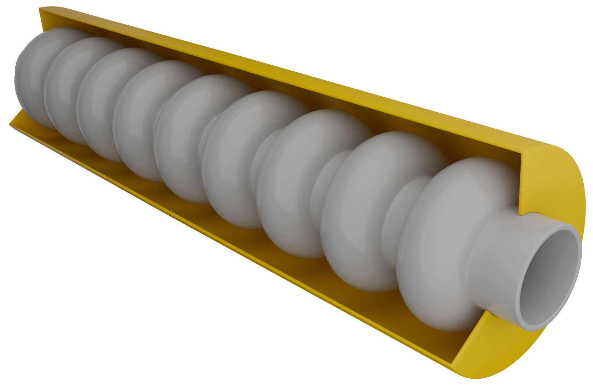
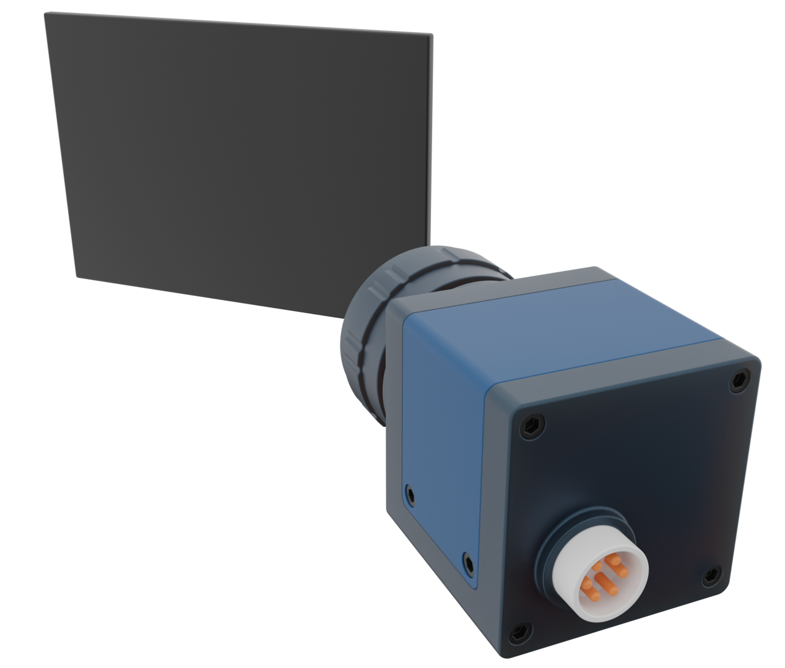

[](https://www.gnu.org/licenses/gpl-3.0)

<!-- [](https://gitlab.com/araffin/stable-baselines3/-/commits/master) -->

# 3D Assets for Particle Accelerators

<!--  -->

Collection of 3D assets for creating beautiful comic-like 3D renders for particle accelerator lattices.

&nbsp;&nbsp;
&nbsp;&nbsp;
&nbsp;&nbsp;

## Where To Find What

Simply install _Cheetah_ from PyPI by running the following command.

```bash
pip install cheetah-accelerator
```

## Cite This Repository

If you use any of the assets in this repository, please cite the following:

```bibtex
@article{kaiser2024cheetah,
    title        = {Bridging the gap between machine learning and particle accelerator physics with high-speed, differentiable simulations},
    author       = {Kaiser, Jan and Xu, Chenran and Eichler, Annika and Santamaria Garcia, Andrea},
    year         = 2024,
    month        = {May},
    journal      = {Phys. Rev. Accel. Beams},
    publisher    = {American Physical Society},
    volume       = 27,
    pages        = {054601},
    doi          = {10.1103/PhysRevAccelBeams.27.054601},
    url          = {https://link.aps.org/doi/10.1103/PhysRevAccelBeams.27.054601},
    issue        = 5,
    numpages     = 17
}
@inproceedings{stein2022accelerating,
    title        = {Accelerating Linear Beam Dynamics Simulations for Machine Learning Applications},
    author       = {Stein, Oliver and Kaiser, Jan and Eichler, Annika},
    year         = 2022,
    booktitle    = {Proceedings of the 13th International Particle Accelerator Conference}
}
```

## Acknowledgements

### Author Contributions

The following people have contributed to these assets:

- Jan Kaiser (@jank324)

### Institutions

The development of Cheetah is a joint effort by members of the following institutions:

&nbsp;&nbsp;

### Funding

The work to create these assets has in part been funded by the IVF project InternLabs-0011 (HIR3X) and the EuXFEL R&D project "RP-513: Learning Based Methods".
In addition, we acknowledge support from DESY (Hamburg, Germany), a member of the Helmholtz Association HGF.
