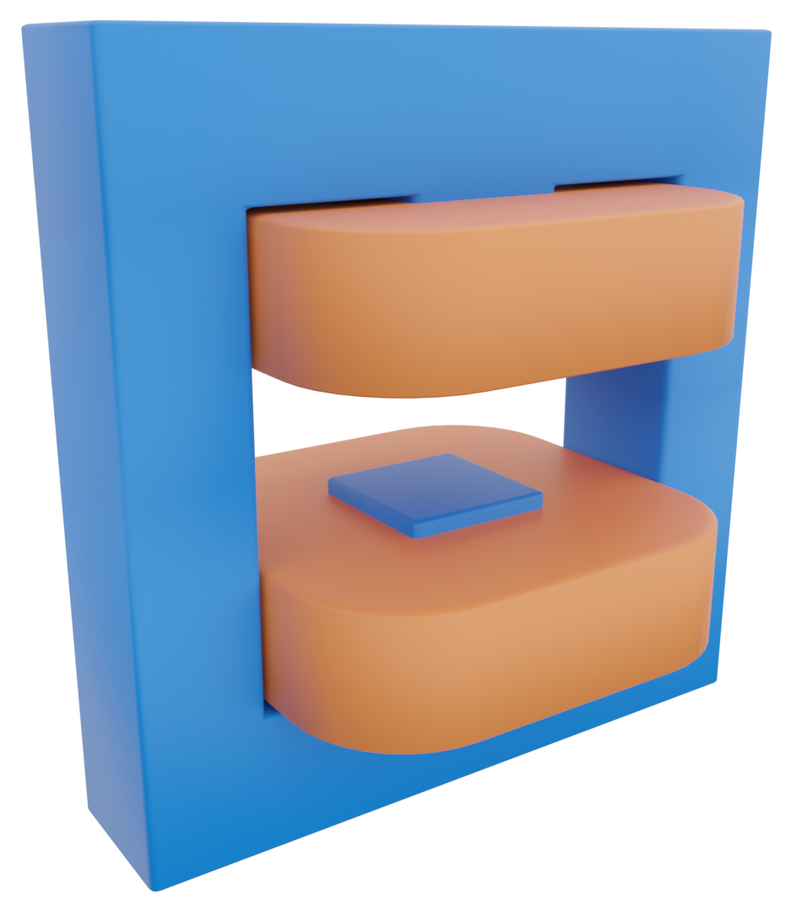
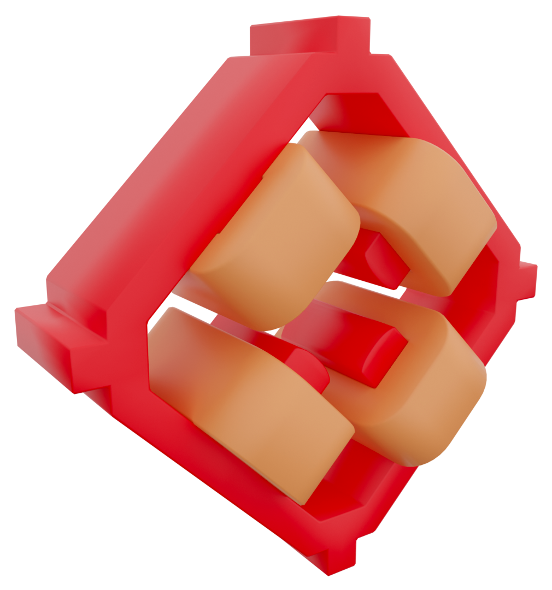
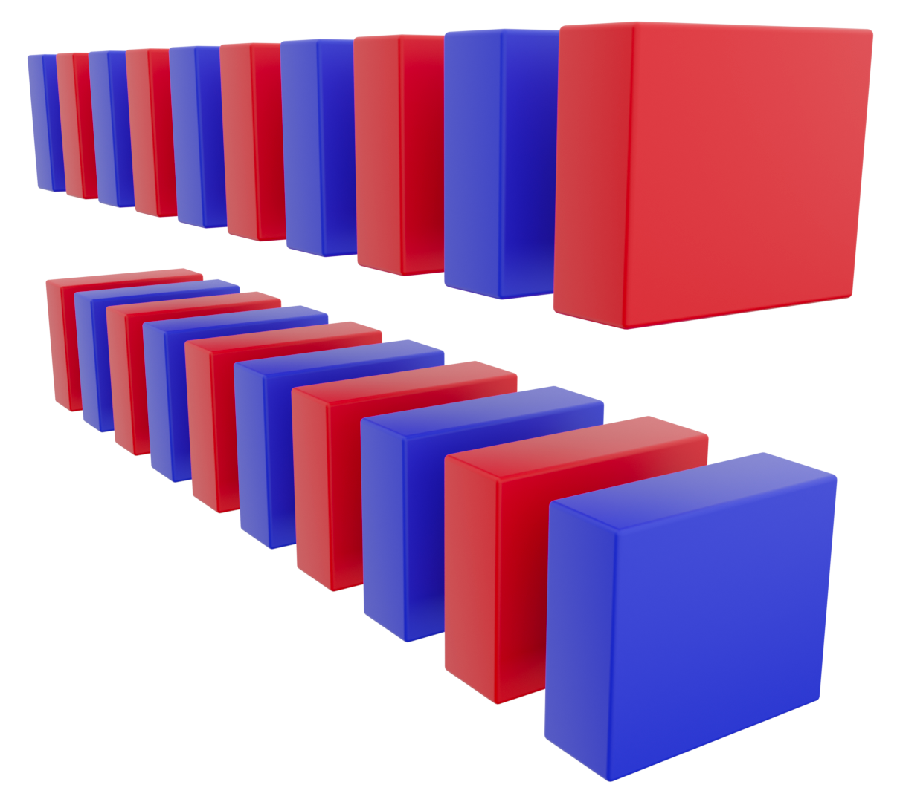

[![CC BY-NC-SA 4.0][cc-by-nc-sa-shield]][cc-by-nc-sa]
[](https://doi.org/10.5281/zenodo.15880056)

<!-- [](https://gitlab.com/araffin/stable-baselines3/-/commits/master) -->

# 3D Assets for Particle Accelerators

<!--  -->

Collection of 3D assets for creating beautiful comic-like 3D renders for particle accelerator lattices.

&nbsp;&nbsp;
&nbsp;&nbsp;
&nbsp;&nbsp;
&nbsp;&nbsp;
&nbsp;&nbsp;
&nbsp;&nbsp;
&nbsp;&nbsp;

## Where To Find What

Currently, all 3D models are stored at the root of this repository, in both the original `.blend` format and as exported `.glb` files. All assets are currently prepared for use in [Cheetah](https://github.com/desy-ml/cheetah), that is with their origin at the beam entry point and with all modifiers applied in the `.blend` files. Models that are not scaled by Cheetah (currently only `screen`) are also sized appropriately.

## Licence and Citation

This work is licensed under a [Creative Commons Attribution-NonCommercial-ShareAlike 4.0 International Licence][cc-by-nc-sa].
An exception is made, where commercial use is permitted specifically for the publication of scientific results in the form of journal articles or conference proceedings.
**If you want to use these assets in ways not covered by this licence, or have questions, you are welcome to [contact me!](mailto:jan.kaiser@desy.de)**

[![CC BY-NC-SA 4.0][cc-by-nc-sa-image]][cc-by-nc-sa]

[cc-by-nc-sa]: http://creativecommons.org/licenses/by-nc-sa/4.0/
[cc-by-nc-sa-image]: https://licensebuttons.net/l/by-nc-sa/4.0/88x31.png
[cc-by-nc-sa-shield]: https://img.shields.io/badge/License-CC%20BY--NC--SA%204.0-lightgrey.svg

If you use any of the assets in this repository, please give credit accordingly and cite the following:

```bibtex
@misc{kaiser2025desyml3dassets,
    title        = {DESY ML - 3D Assets for Particle Accelerators},
    author       = {Kaiser, Jan},
    year         = 2025,
    publisher    = {GitHub},
    doi          = {10.5281/zenodo.15880056},
    url          = {https://github.com/desy-ml/3d-assets},
    copyright    = {Creative Commons Attribution-NonCommercial-ShareAlike 4.0 International Licence}
}
```

## Acknowledgements

### Author Contributions

The following people have contributed to these assets:

- Jan Kaiser (@jank324)

### Institutions

The development of these assets was supported by the following institutions:

&nbsp;&nbsp;

### Funding

The work to create these assets has in part been funded by the IVF project InternLabs-0011 (HIR3X) and the EuXFEL R&D project "RP-513: Learning Based Methods".
In addition, we acknowledge support from DESY (Hamburg, Germany), a member of the Helmholtz Association HGF.
